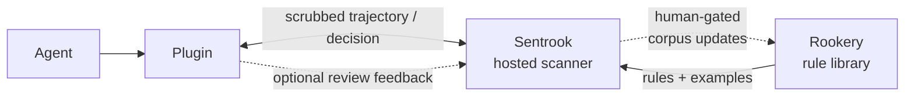
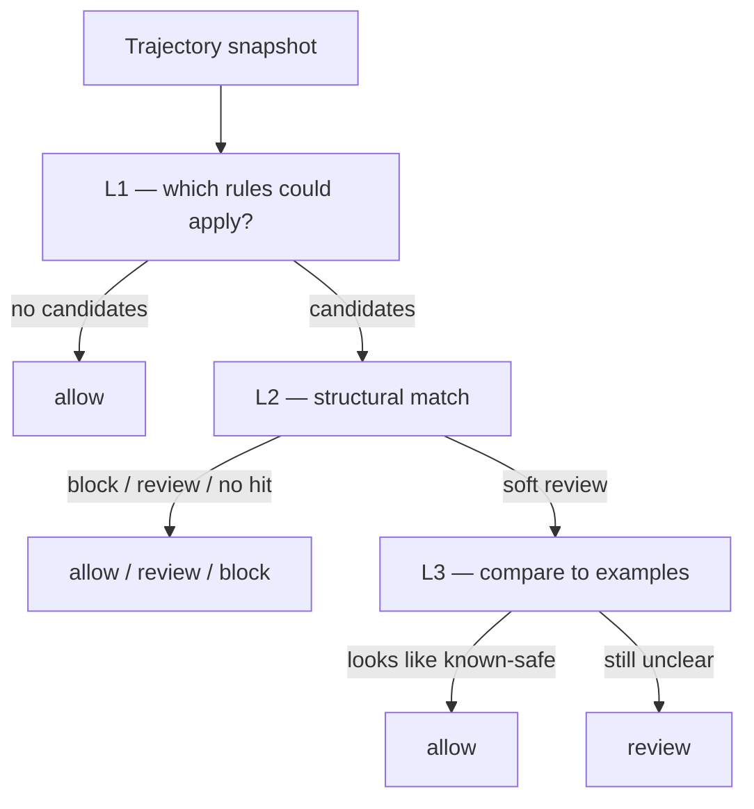

# Sentrook

[](LICENSE)
[](https://www.npmjs.com/package/@firstdataunion/sentrook-openclaw)

Sentrook is a runtime security scanner developed by [FIDU](https://firstdataunion.org), 
intended for open-source AI agents: it catches, reviews, and blocks dangerous actions 
before they happen, backed by an ever-evolving, community-grown library of attack patterns 
and execution examples. Shared knowledge keeps the flock safe.

## What is Sentrook

Sentrook is a trajectory scanner that runs against pending agent actions at
runtime. It watches for dangerous actions triggered by any kind of prompt the
agent may read — from you, a poisoned web article, or an MCP server description —
and stops them before they can expose your system or secrets. It uses a
generalised execution-path format that captures not only what an agent is about
to do, but also the tool calls that led up to it. That context is what lets
Sentrook spot cases where a single action looks harmless on its own, but may be
risky given what came before — and warn you before you or your agent are exposed.

Sentrook uses a library of attack rules and execution examples to scan each tool
call, then either allows it to continue, holds execution until you review it, or
in extreme cases hard-blocks the call. The library is an ever-growing,
community-sourced set of data, so coverage can keep up as agent security threats
change. When you use Sentrook, you can anonymously, securely, and safely share
execution data to grow that library and help other open-source users stay safer
too. (Putting personal data to good use for the wider community, while keeping
your interests first, is one of the key goals of FIDU — see
[our mission](https://firstdataunion.org).)

Sentrook aims to be easy to set up and use, with easy install and minimal
configuration. The main path today is FIDU's hosted instance of Sentrook,
backed by the community library: install a thin plugin for your agent (OpenClaw
first; more to come — see [Roadmap](#roadmap)), authorise it with a free FIDU
account, and you're good to go. The plugin scrubs sensitive data from the
execution path and securely shares the sanitised version with our scanner API,
which returns an allow, block, or review decision in less than a second.

This "online" setup works very well for ease of use and install, but we're well
aware that hot-path network hops aren't ideal for the more security-conscious
users, and out of the question for certain agents that hold particularly
sensitive data. A full offline option is something we'd love to offer for
Sentrook, and is on our roadmap — see [Roadmap](#roadmap).

## Status of this repository

This repo contains Sentrook (the scanner engine), a test harness (TestNest), the
OpenClaw plugin (`sentrook-openclaw`), and a small library of demo rules. The
rules library code (Rookery) and the live library data are private for now. That
protects the library while we test this early version of Sentrook.

We want this repo to give keen users enough to run their own Sentrook instance
and build their own rule library eventually (docs are still WIP). The primary
offering right now is the hosted scanner: a free FIDU account gets you access to
the scan API backed by the live rules library.

- **In this repo:** scanner engine, TestNest harness, OpenClaw plugin, DEMO `examples/` (format + smoke only)
- **Not in this repo:** production rules and corpus (not publicly available)
- Gitignored `rules/`, `corpus/`, `eval/` may appear locally for FIDU maintainers — they are not part of the public checkout
- Hosted scan: `https://sentrook.firstdataunion.org` (pinned plugin origin)

## Install

### OpenClaw

#### Prerequisites

- **OpenClaw ≥ 2026.6.0** (native or Docker Compose). Sentrook needs
  `before_tool_call` with `requireApproval` (added in OpenClaw 2026.3.28;
  2026.6.0 is the earliest we have tested against)
- Network access from your OpenClaw host to
  `https://sentrook.firstdataunion.org` — every tool call sends a scrubbed
  trajectory there for a decision
- A free [FIDU account](https://firstdataunion.org) — the configure wizard
  walks you through creating an OAuth client for the scan API

```bash
# 1. Install the plugin (tracks npm latest — see Updates below)
openclaw plugins install npm:@firstdataunion/sentrook-openclaw

# 2. Interactive setup: data-sharing prefs, FIDU credentials
openclaw sentrook configure

# 3. Restart the gateway so it picks up ~/.openclaw/.env and the plugin config
#    (native: openclaw gateway restart)
#    (Docker Compose: docker compose restart openclaw-gateway)
#    `openclaw-gateway` is the default Compose service name; `docker compose ps`
#    if yours differs (container names like openclaw-gateway-1 are not the same)

# 4. Sanity-check config, credentials, OIDC token mint, and scan host reachability
openclaw sentrook verify

# 5. Exercise a real tool call (ask the agent to use a tool), then check gateway
#    logs for [sentrook-openclaw] — verify cannot prove the live scan path alone
#    native: openclaw logs --follow
#    Docker: docker compose logs -f openclaw-gateway 2>&1 | grep sentrook-openclaw
```

After this, Sentrook will begin scanning tool calls — allowing them, asking you
to review, or blocking where appropriate. A green verify means config + Identity
token mint look good; a tool call in the logs is the end-to-end check.

> [!IMPORTANT]
> If you talk to your agent over a messaging channel (Discord, Slack, Telegram,
> …), configure OpenClaw so **approval / review prompts are delivered on that
> channel**. Sentrook `review` decisions become OpenClaw approval requests;
> without channel delivery, those prompts may never reach you and the agent can
> sit blocked waiting for a decision you never see.
>
> Official OpenClaw docs:
> [Approval forwarding to chat channels](https://docs.openclaw.ai/tools/exec-approvals-advanced#approval-forwarding-to-chat-channels).  
> Worked Discord example:
> [Chat-channel approvals](integrations/openclaw/README.md#chat-channel-approvals).

Running under Docker Compose? Use the same commands inside the gateway
container (`docker compose exec openclaw-gateway openclaw...`), then restart as
above. `openclaw-gateway` is OpenClaw's default Compose **service** name — check
`docker compose ps` if a command reports no such service.

#### Updates

OpenClaw does not auto-update plugins on restart, and npm will not notify your
gateway when something new ships. Sentrook is early — stay on npm `latest` and
every so often run:

```bash
openclaw plugins update @firstdataunion/sentrook-openclaw
# or: openclaw plugins update --all
```

then restart the gateway.

#### Uninstall

```bash
openclaw plugins uninstall sentrook-openclaw
# restart gateway if it does not reload plugins automatically
```

That removes the managed plugin install and the
`plugins.entries.sentrook-openclaw` config entry. Scan credentials in
`~/.openclaw/.env` (`SENTROOK_SCAN_*`) and the local allowlist
(`~/.openclaw/sentrook-allowlist.json`) are left in place — delete those by hand
if you want a full purge.

Config reference, Docker notes, channel approvals, local allowlist, sanitisation /
privacy, non-interactive configure, CLI:
[integrations/openclaw/README.md](integrations/openclaw/README.md).

### Other agents

**Hermes Agent (beta):** thin Python plugin under
[`integrations/hermes/`](integrations/hermes/README.md) — hosted `/scan`, native
`approve` + `rule_key`, `hermes sentrook configure|verify`. Install from a clone
until the community index lists it; see that README for Discord/cron/YOLO notes.

More adapters (Pi and others) are on the roadmap. Suggestions or help:
hello@firstdataunion.org, or open an issue.

## Configuration

OpenClaw plugin settings (what configure writes, timeouts, feedback, allowlist):
[integrations/openclaw/README.md#configuration](integrations/openclaw/README.md#configuration).

### Self-host / local engine

Running the Python scanner yourself against a custom ruleset is possible from
this repo (`sentrook scan` / `sentrook serve`) but is **not** the supported
product path yet — docs and packaging for that come later. Watch this space...

## How it works

Sentrook's goal is simple: before your agent runs a
tool, decide whether that action should continue, wait for you, or stop —
using not just the pending call, but the short path of tool use that led there.

That trajectory context is the main idea. A single `exec` or `write` often looks
harmless on its own; it may look very different after a poisoned web page, a
crafted MCP description, or a chain of earlier steps. Sentrook is built around
that sequence, not a one-shot keyword filter.

### At the tool boundary



When the agent is about to call a tool, a thin plugin:

1. Builds a short **trajectory snapshot** (PlanIR) — recent tool calls in the
   session plus the pending action (including a truncated prompt-as-intent field)
2. **Scrubs** credentials, common secret patterns, and obvious PII in that
   snapshot before it leaves your machine
3. `POST`s that snapshot to the hosted scanner over HTTPS
4. Applies the decision: continue, ask you, or veto

You stay in the loop for the interesting cases. The three outcomes are:

- **allow** — continue as normal
- **review** — pause and ask you (allow once, allow every time, or deny)
- **block** — hard-stop the tool call

Most everyday traffic is allowed quickly. Review is for "this looks risky —
you should see it." Block is reserved for the clearer high-severity matches.

If the scan host is unreachable or times out, the plugin **fails open** so the
agent keeps working (see [Timeouts](integrations/openclaw/README.md#timeouts)).
Once a `review` is on screen, timeouts **fail closed** by default — no answer
means the call does not run.

### Inside the scanner



Cheap checks run first; deeper work only when it helps:

- **L1** — given the tools and shape of the trajectory, which rules could
  possibly apply? If none could, the call is allowed early.
- **L2** — structural match against those candidates (tool sequences, pending
  action, argument / result conditions, and similar). A hit can ask for
  **review** or **block**. If several rules fire, **block** wins over
  **review**. No hit → **allow**.
- **L3** — for some soft reviews only, compare the trajectory to known attack
  and benign **examples**. Strong evidence that it looks like safe usage can
  downgrade a soft review to **allow**; otherwise the review stands. L3 does
  not escalate to block.

Most allows never reach L3. The heavier pass is for ambiguous cases where
examples help more than structure alone.

### Privacy and community contribution

FIDU is a data-governance not-for-profit: your interests come first, and shared
knowledge should still be able to help everyone else
([our mission](https://firstdataunion.org)).

**What leaves your machine on every scan:** a scrubbed trajectory — pending
action, short prior context, and a truncated / pattern-scrubbed intent. Scrubbing
catches credentials and common PII patterns; it is **not** a full guarantee that
no personal detail remains in free-form text. Prefer not putting secrets in
prompts you would not want on the scan path. On that path the hosted scanner
evaluates the plan **in memory and does not store or log the execution plan** —
the PlanIR body is not written to disk. (A separate ops decision log may record
ids, outcome, and matched rule ids without the plan itself.)

**Community contribution (on by default, easy to opt out):** when you resolve a
review (allow-once or deny) and contribution is on (`feedback.mode: "submit"`,
the configure default), a sanitized copy of that outcome can be sent as a
candidate example. Before it is considered for the shared library, the hosted
side replaces the raw prompt-as-intent with a short **derived intent** built from
the trajectory (tool sequence + a brief pending-arg sketch), and keeps **only the
steps the rule matched** (the pending action plus any prior steps that fired it)
— not the rest of the session. Submissions are scrubbed again and **reviewed by
humans** before anything is published — nothing goes live automatically. Opt out
in the wizard or with `feedback.mode: "off"`.

More detail on scrubbing, logs, and channel approvals:
[integrations/openclaw/README.md](integrations/openclaw/README.md).

### Rule library

The hosted scanner is backed by a shared library with two parts:

1. **Rules** — patterns of risky behaviour (tool sequences, intents, argument
   shapes) and whether a match should ask for review or hard-block
2. **Examples (corpus)** — concrete trajectories labelled attack-like or benign,
   used on borderline (soft) cases

Rules give structure; examples help when structure alone is not enough. The
library grows as the community and FIDU maintainers contribute sanitized review
outcomes and new patterns. Production rules and live corpus data are private for
now (see [Status of this repository](#status-of-this-repository)); the engine,
plugin, and DEMO format examples are what this repo ships.

## Roadmap

Sentrook is in early stages of development, and we have big plans. No exact timelines 
yet, but here is what we are looking at next:

- More native agent adapters beyond OpenClaw and Hermes (Pi is high on the list)
- More public documentation of the rule library format, so self-hosted setups get easier
- An offline-only mode for people who want stronger locality and are willing to do a bit more setup
- Static config checkers / audits built into each agent plugin to further harden the agent environment
- Better channels for the community to contribute attack rules and related code

## Contributing

See [CONTRIBUTING.md](CONTRIBUTING.md) and [CODE_OF_CONDUCT.md](CODE_OF_CONDUCT.md).

Public CI on this repo covers lint, unit tests, DEMO smoke TestNest, OpenClaw
plugin tests, and Hermes plugin unit tests. Full policy-bound eval stays with
FIDU maintainers (not required for a clean public checkout).

Harness details: [testnest/README.md](testnest/README.md).

## Security

Please read [SECURITY.md](SECURITY.md) before reporting vulnerabilities. Do not
open public issues for security reports.

## License

[MIT](LICENSE) — Copyright (c) 2026 First International Data Union Ltd

## Layout

| Path | Purpose |
|------|---------|
| `sentrook/` | Scanner package (`planir`, `serve`, layers), unit tests |
| `testnest/` | Scenario harness (smoke suites in this repo) |
| `docs/` | Public language/API docs (stub for now) |
| `examples/rules`, `examples/corpus` | Synthetic DEMO-* format examples |
| `fixtures/plans` | Minimal PlanIR 1.0 smoke inputs |
| `integrations/openclaw/` | OpenClaw plugin — builds PlanIR 1.0 and POSTs `/scan` |
| `integrations/hermes/` | Hermes Agent plugin (Python) — same hosted `/scan` path |
