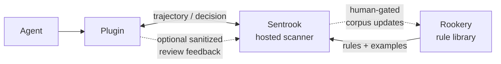
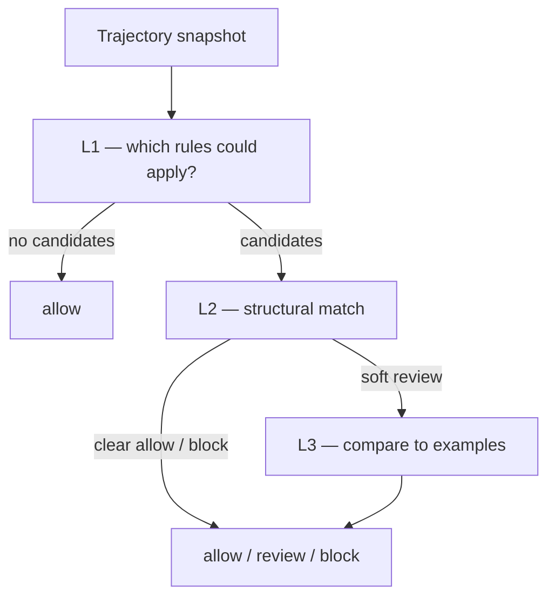

# Sentrook

[](LICENSE)
[](https://www.npmjs.com/package/@firstdataunion/sentrook-openclaw)

Sentrook is a runtime security scanner developed by FIDU, intended for open-source
AI agents: it catches, reviews, and blocks dangerous actions before they happen,
backed by an ever-evolving, community-grown library of attack patterns and
execution examples. Shared knowledge keeps the flock safe.

## What is Sentrook

Sentrook is a trajectory scanner that runs against pending agent actions at
runtime. It uses a generalised execution-path format that captures not only what
an agent is about to do, but also the tool calls that led up to it. That context
is what lets Sentrook spot cases where a single action looks harmless on its own,
but looks risky given what came before — and warn you before you or your agent
are exposed.

Sentrook uses a library of attack rules and execution examples to scan each tool
call, then either allows it to continue, holds execution until you review it, or
in extreme cases hard-blocks the call. The library is an ever-growing,
community-sourced set of data, so coverage can keep up as agent security threats
change. When you use Sentrook, you can anonymously, securely, and safely share
execution data to grow that library and help other open-source users stay safer
too. (Putting personal data to good use for the wider community, while keeping
your interests first, is the main idea behind FIDU — see
[our mission](https://firstdataunion.org).)

Using Sentrook is meant to be easy. The main path today is FIDU's hosted scanner,
backed by the community library: install a thin plugin for your agent (OpenClaw
first; more to come — see [Roadmap](#roadmap)), authorise it with a free FIDU
account, and you're good to go. The plugin includes a small CLI for data-sharing
preferences and other settings — see
[Install and configuration](#install-and-configuration).

## Status of this repository

This repo contains Sentrook (the scanner engine), a test harness (TestNest), the
OpenClaw plugin (`sentrook-openclaw`), and a small library of demo rules. The
rules library code (Rookery) and the live library data are private for now. That
protects the library while we test this early version of Sentrook — it is not
necessarily where we want to end up. See the [roadmap](#roadmap) below.

We want this repo to give keen users enough to run their own Sentrook instance
and build their own rule library eventually (docs are still WIP). The primary
offering right now is the hosted scanner: a free FIDU account gets you access to
the scan API backed by the live rules library.

- **In this repo:** scanner engine, TestNest harness, OpenClaw plugin, DEMO `examples/` (format + smoke only)
- **Not in this repo:** production rules and corpus (not publicly available)
- Gitignored `rules/`, `corpus/`, `eval/` may appear locally for FIDU maintainers — they are not part of the public checkout
- Hosted scan: `https://sentrook.firstdataunion.org` (plugin default)

## Quick start

### OpenClaw

If you already have OpenClaw running, getting Sentrook online is a short plugin
install plus a one-time configure. You will need a free FIDU account so the
plugin can authenticate to the hosted scanner — the configure wizard walks you
through that, including whether you are happy to contribute anonymised review
decisions back to the community library.

```bash
# 1. Install the plugin (tracks npm latest — see update note below)
openclaw plugins install npm:@firstdataunion/sentrook-openclaw --force

# 2. Interactive setup: scan URL, data-sharing prefs, FIDU credentials
openclaw sentrook configure

# 3. Restart the gateway so it picks up ~/.openclaw/.env and the plugin config
#    (native: openclaw gateway restart)
#    (Docker Compose: docker compose restart openclaw-gateway)

# 4. Sanity-check config, credentials, and that the scan host is reachable
openclaw sentrook verify
```

After this, Sentrook will begin scanning tool calls made by your agent — allowing
them, asking you to review, or blocking where appropriate.

> [!IMPORTANT]
> If you talk to your agent over a messaging channel (Discord, Slack, Telegram, …), configure OpenClaw so **approval / review prompts are delivered on that channel**. Sentrook `review` decisions become OpenClaw approval requests; without channel delivery, those prompts may never reach you and the agent can sit blocked waiting for a decision you never see.
>
> Official OpenClaw docs: [Approval forwarding to chat channels](https://docs.openclaw.ai/tools/exec-approvals-advanced#approval-forwarding-to-chat-channels).  
> Worked Discord example and notes: [Chat-channel approvals](integrations/openclaw/README.md#chat-channel-approvals) in the OpenClaw plugin guide.

We recommend staying on the npm `latest` line rather than pinning forever.
Sentrook is early and moving; security and compatibility fixes land in new
plugin releases. OpenClaw does not auto-update plugins on restart, and npm will
not notify your gateway when something new ships — so every so often run:

```bash
openclaw plugins update @firstdataunion/sentrook-openclaw
# or: openclaw plugins update --all
```

then restart the gateway. If you prefer a frozen production pin (`@1.0.0 --pin`),
that still works; just plan to bump it yourself when you want fixes.

Running OpenClaw under Docker Compose? Use the same commands inside the gateway
container (without `-T`, so the configure prompts work), then restart as above.
For config reference (what configure writes, settings, non-interactive flags) see
[Install and configuration](#install-and-configuration). For Docker
channel-approvals, allowlist, sanitisation / privacy, and uninstall detail, see
[integrations/openclaw/README.md](integrations/openclaw/README.md).

### Other agents

More agent integrations coming soon. We're working towards native support for
Hermes and Pi too. If you have suggestions for other platforms, we'd love to
hear from you: hello@firstdataunion.org, or open an issue.

## Install and configuration

Quick start above is enough to get scanning. This section is the **config
reference** and the index of per-integration guides.

| Integration | Quick start | Full guide |
|-------------|-------------|------------|
| OpenClaw (hosted Sentrook) | [Quick start — OpenClaw](#openclaw) | [integrations/openclaw/README.md](integrations/openclaw/README.md) |
| Hermes / Pi | — | Coming soon |

### OpenClaw (hosted)

Interactive install, verify, updates, Docker notes, and the chat-approval
warning live in [Quick start — OpenClaw](#openclaw). Deeper topics (channel
approvals, local allowlist, sanitisation / privacy, maintainers) live in the
[OpenClaw plugin README](integrations/openclaw/README.md).

#### Prerequisites

| Requirement | Notes |
|-------------|--------|
| OpenClaw gateway | Native or Docker Compose |
| Free FIDU account | OAuth client for scan API (`client_credentials`, scope `sentrook.scan`) — configure wizard links the Identity console |
| Network | Plugin `POST`s to `https://sentrook.firstdataunion.org` by default |

#### Package and endpoints

| Item | Value |
|------|--------|
| npm package | [`@firstdataunion/sentrook-openclaw`](https://www.npmjs.com/package/@firstdataunion/sentrook-openclaw) |
| Hosted scanner | `https://sentrook.firstdataunion.org` |

Plugin SemVer is independent of the Sentrook scanner engine.

#### Non-interactive configure

For CI / scripted hosts (skips the wizard):

```bash
openclaw sentrook configure --non-interactive \
  --client-id "$SENTROOK_SCAN_CLIENT_ID" \
  --client-secret "$SENTROOK_SCAN_CLIENT_SECRET"
# optional: --url --timeout-ms --contribute-corpus false --api-key
```

Then restart the gateway and run `openclaw sentrook verify`.

#### What configure writes

| Location | Contents |
|----------|----------|
| `~/.openclaw/.env` | `SENTROOK_SCAN_CLIENT_ID` / `SENTROOK_SCAN_CLIENT_SECRET` (or shared API key). Prefer this over compose `env_file` so a normal **restart** reloads secrets |
| `openclaw.json` → `plugins.entries.sentrook-openclaw` | `enabled`, `url`, `timeoutMs`, feedback / corpus contribution. PlanIR sanitization is always enabled. **No** credentials in this file (unresolved SecretRefs fail-close the gateway) |

Configure does **not** restart the gateway — do that yourself after the first
setup or after credential changes.

#### Plugin settings

| Setting | Default | Role |
|---------|---------|------|
| `url` | `https://sentrook.firstdataunion.org` | Scan service base URL |
| `timeoutMs` | `3000` (HTTPS) | Bounds the `/scan` wait; on timeout the plugin fails open |
| `feedback.mode` | `submit` (wizard default) | `submit` posts sanitized allow-once / deny reviews to `/feedback` for the community corpus (human-gated publish). Opt out: wizard prompt, `--contribute-corpus false`, or `feedback.mode: "off"` |

Decisions: **allow** (continue), **review** (OpenClaw approval UI), **block**
(veto). Channel delivery for reviews:
[Chat-channel approvals](integrations/openclaw/README.md#chat-channel-approvals).
Local allow-always store:
[Allow every time](integrations/openclaw/README.md#allow-every-time-local-allowlist).

#### CLI reference

| Command | Purpose |
|---------|---------|
| `openclaw sentrook configure` | Credentials + plugin entry |
| `openclaw sentrook verify` | Config, credentials loaded?, `GET /health` |
| `openclaw sentrook allowlist list\|path\|clear --yes` | Inspect / wipe local allow-always store |

#### Uninstall

```bash
openclaw plugins uninstall sentrook-openclaw
# restart gateway if it does not reload plugins automatically
```

That removes the managed plugin install and the `plugins.entries.sentrook-openclaw`
config entry. Scan credentials in `~/.openclaw/.env` (`SENTROOK_SCAN_*`) and the
local allowlist (`~/.openclaw/sentrook-allowlist.json`) are left in place — delete
those by hand if you want a full purge.

### Self-host / local engine

Running the Python scanner yourself against a custom ruleset is possible from
this repo (`sentrook scan` / `sentrook serve`) but is **not** the supported
product path yet — docs and packaging for that come later. Watch this space...

## How it works

### Architecture



Sentrook sits on the tool-call boundary of your agent. When the agent is about
to run a tool, a thin plugin builds a short **trajectory snapshot** of what has
already happened in the current session plus the pending action, scrubs
sensitive fields (including raw prompts, PII, keys), and sends that snapshot to
the hosted scanner over HTTPS.

The scanner evaluates the trajectory against the community rule library and
returns a decision:

- **allow** — continue as normal
- **review** — pause and ask you
- **block** — veto the tool call

If you opted in to community corpus contribution, your allow-once / deny review
resolutions can be sent back as sanitized examples. Those submissions are
scrubbed again in detail to redact anything remotely sensitive, then reviewed
before anything is published into the shared library — nothing goes live
automatically.

### Scanner



The engine runs in layers so cheap checks happen first and deeper analysis only
runs when it is useful:

- **L1** — a fast index pass. Given the tools and shape of the trajectory, which
  rules could possibly apply? If nothing could match, the call is allowed early.
- **L2** — structural matching against those candidate rules (sequences of
  tools, pending action, arguments, and similar conditions). A confident match
  can produce **allow**, **review**, or **block**. If several rules fire,
  **block** wins over **review**, which wins over **allow**.
- **L3** — a similarity check against known examples, used mainly when L2 is
  unsure (**review**). It compares the trajectory to attack and benign examples
  for the matched rule(s). Strong evidence that the behaviour looks like known
  safe usage can downgrade a soft review to **allow**; otherwise the review (or
  harder outcome) stands.

Most everyday allows never reach L3. The heavier checks are for the ambiguous
cases where context matters most.

### Rule library and examples

The hosted scanner is powered by a shared library with two parts:

1. **Rules** — descriptions of risky behaviour patterns (what sequence of tools,
   intents, or argument shapes should raise concern, and whether a match should
   ask for review or hard-block).
2. **Examples (corpus)** — concrete trajectories labelled as attack-like or
   benign for those rules. These are what L3 uses on borderline cases: does this
   look more like a known bad path, or more like something we have already seen
   as safe?

Rules give the scanner structure to match against; examples help it judge when
structure alone is not enough. The library grows as the community (and FIDU
maintainers) contribute sanitized review outcomes and new patterns. Humans still
gate what gets published, so coverage can improve without publishing every
personal trajectory by default.

## Roadmap

Sentrook is early, and we have big plans. No exact timelines yet, but here is
what we are looking at next:

- More native agent adapters beyond OpenClaw (Hermes and Pi are high on the list)
- More public documentation of the rule library format, so self-hosted setups get easier
- An offline-only mode for people who want stronger locality and are willing to do a bit more setup
- Static config checkers / audits built into each agent plugin to further harden the agent environment
- Better channels for the community to contribute attack rules and related code

## Contributing

See [CONTRIBUTING.md](CONTRIBUTING.md) and [CODE_OF_CONDUCT.md](CODE_OF_CONDUCT.md).

Public CI on this repo covers lint, unit tests, DEMO smoke TestNest, and OpenClaw
plugin tests. Full policy-bound eval stays with FIDU maintainers (not required
for a clean public checkout).

Harness details: [testnest/README.md](testnest/README.md).

## Security

Please read [SECURITY.md](SECURITY.md) before reporting vulnerabilities. Do not
open public issues for security reports.

## License

[MIT](LICENSE) — Copyright (c) 2026 FirstDataUnion

## Layout

| Path | Purpose |
|------|---------|
| `sentrook/` | Scanner package (`planir`, `serve`, layers), unit tests |
| `testnest/` | Scenario harness (smoke suites in this repo) |
| `docs/` | Public language/API docs (stub for now) |
| `examples/rules`, `examples/corpus` | Synthetic DEMO-* format examples |
| `fixtures/plans` | Minimal PlanIR 1.0 smoke inputs |
| `integrations/openclaw/` | OpenClaw plugin — builds PlanIR 1.0 and POSTs `/scan` |
